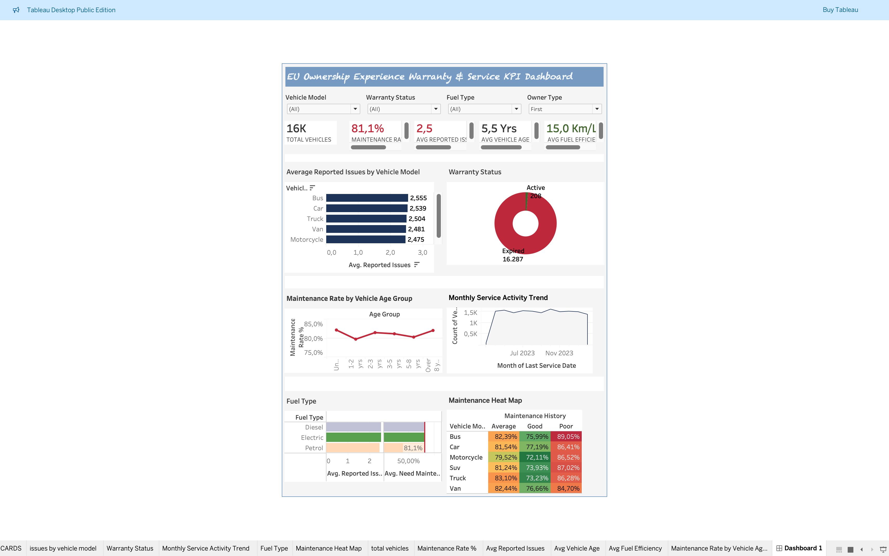

# EU Ownership Experience Warranty & Service KPI Dashboard



## 📌 Project Overview
An end-to-end data analytics project built to simulate the **EU Ownership Experience Warranty & Service Reporting Pipeline.**  
Developed using **MySQL, Python, and Tableau Public** — covering data extraction from SQL databases, data cleaning, KPI definition, and interactive dashboard delivery across Ownership Experience teams.

This project directly reflects the responsibilities of an **EU Ownership Experience Data Analyst:**
- Extraction and integration of vehicle data from SQL databases (ERP simulation)
- Definition, implementation and maintenance of KPIs for Warranty and Service Marketing teams
- Data cleaning and preparation using Python — Pandas, Matplotlib and Seaborn
- Development of an interactive Warranty Reporting Portal in Tableau to track and manage market KPIs
- Supporting Ownership Experience teams with data-driven pre-decision analysis

---

## 🛠️ Tools & Technologies
| Tool | Purpose |
|---|---|
| **MySQL** | Schema creation, data loading, KPI queries |
| **Python — Pandas** | Data cleaning, feature engineering, null handling |
| **Python — Matplotlib & Seaborn** | Data visualization — 6 charts |
| **Tableau Public** | Interactive KPI dashboard |
| **GitHub** | Version control and documentation |

---

## 📊 Dataset
- **Source:** Vehicle_Maintenance_Dataset ([Kaggle](https://www.kaggle.com/datasets/chavindudulaj/vehicle-maintenance-data))
- **Size:** 50,000 vehicle records
- **Original columns:** 20
- **Columns used:** 13 (selected for Warranty & Service Marketing relevance)

### Selected Columns
| Column | Description | Team |
|---|---|---|
| Vehicle_Model | Car, SUV, Van, Truck, Bus, Motorcycle | Warranty |
| Warranty_Expiry_Date | Date warranty expires | Warranty |
| Reported_Issues | Number of reported issues per vehicle | Warranty |
| Vehicle_Age | Age of vehicle in years | Warranty |
| Maintenance_History | Good / Average / Poor | Warranty |
| Need_Maintenance | 1 = Yes, 0 = No | Warranty |
| Last_Service_Date | Date of last service | Service Marketing |
| Fuel_Type | Diesel / Petrol / Electric | Service Marketing |
| Mileage | Total mileage | Service Marketing |
| Odometer_Reading | Current odometer reading | Service Marketing |
| Owner_Type | First / Second / Third owner | Service Marketing |
| Fuel_Efficiency | km/l | BI |
| Accident_History | Number of accidents | BI |

---

## 🔑 Key KPIs

| KPI | Value | Unit |
|---|---|---|
| Total Vehicles | 50,000 | count |
| Maintenance Rate | 81.0% | % of fleet |
| Avg Reported Issues | 2.50 | issues per vehicle |
| Avg Vehicle Age | 5.49 | years |
| Avg Fuel Efficiency | 14.99 | km/l |
| Total Accidents | 75,078 | count |

---

## 💡 Key Findings
1. **81% of vehicles require maintenance** — 4 in every 5 vehicles need attention, driven by average fleet age of 5.5 years
2. **Poor maintenance history = 90% maintenance rate** vs 70% for Good history — a 20 percentage point gap directly impacting warranty costs
3. **Cars and Buses show highest issue rates** at 2.52 avg issues per vehicle vs Motorcycles at 2.47
4. **All fuel types show similar KPIs** — Diesel, Petrol and Electric all average 81% maintenance rate and 2.5 issues, suggesting fuel type is not a primary driver of warranty claims
5. **Service activity peaked May–August 2023** then stabilized — seasonal servicing pattern visible in the trend chart

---

## 📁 Project Structure
```
eu-ownership-experience-warranty_service-dashboard/
├── sql/ (Phase_1-2_queries.sql)
│   ├── phase1_create_table     # Schema creation & data load
│   └── phase2_kpi_queries       # 8 KPI queries across 3 teams
├── python/(phase3_warranty_kpi.ipynb )
│   └── phase3_warranty_kpi     # Cleaning + 6 visualizations
├── data/()
│   └── warranty_clean.csv            # Cleaned dataset (13 columns)
├── screenshots/
│   ├── dashboard.png                 # Final Tableau dashboard
│   ├── chart1_issues_by_model
│   ├── chart2_Warranty_status
│   ├── chart3_maintenance_by_age
│   ├── chart4_monthlyservice_trend
│   ├── chart5_fuel_type
│   └── chart6_heatmap
└── README.md
```

---

## 🚀 How to Run

### SQL
1. Install MySQL Workbench
2. Select (phase 1) in `Phase_1-2_queries.sql` & Run to create schema
3. Import `vehicle_maintenance_data.csv` using Table Data Import Wizard
4. Select (phase 2) in `Phase_1-2_queries.sql` & Run for all KPI queries

### Python
1. Install dependencies:
```bash
pip install pandas matplotlib seaborn
```
2. Open `python/phase3_warranty_kpi.ipynb` in Jupyter Notebook
3. Update CSV file path in Cell 2
4. Run all cells — outputs saved to `/outputs/` folder

### Tableau
1. Open Tableau Public
2. Connect to `data/warranty_clean.csv`
3. View dashboard: Tableau Dashboard([Automotive_Warranty_service.twb])

---

## 📸 Dashboard Preview


---

## 👤 Author
**Tharun Teja Muthyala**  
[LinkedIn]([https://www.linkedin.com/in/muthyalatharunteja]) | [GitHub]([https://github.com/muthyalatharunteja]) | [PORTFOLIO] ([https://muthyalatharunteja.github.io/Portfolio/])

---

## 📄 License
This project is for portfolio and educational purposes.
